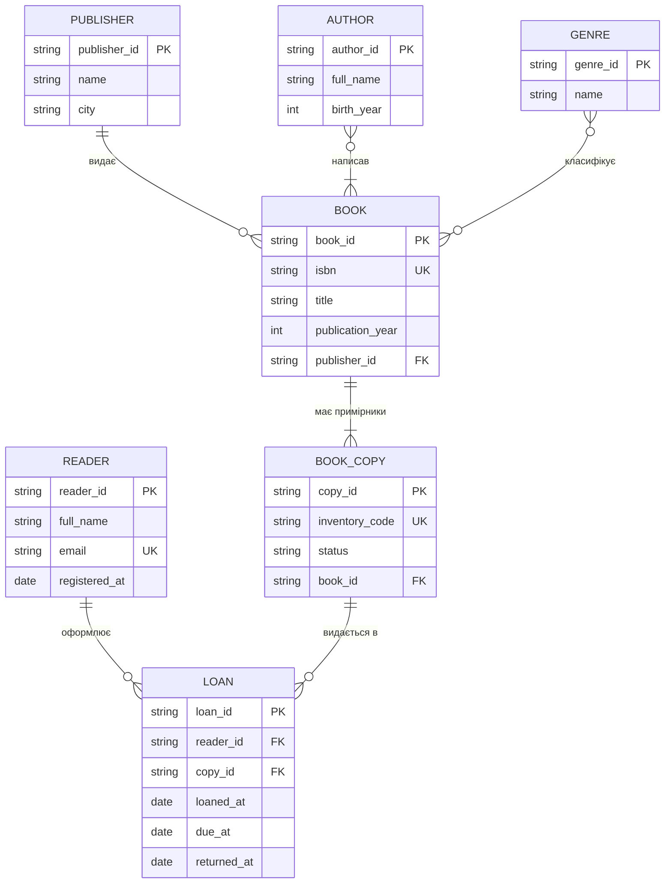

# ER-діаграма

```mermaid
erDiagram
    PUBLISHER ||--o{ BOOK : "видає"
    AUTHOR }o--|{ BOOK : "написав"
    GENRE }o--o{ BOOK : "класифікує"
    BOOK ||--|{ BOOK_COPY : "має примірники"
    READER ||--o{ LOAN : "оформлює"
    BOOK_COPY ||--o{ LOAN : "видається в"

    PUBLISHER {
        string publisher_id PK
        string name
        string city
    }
    AUTHOR {
        string author_id PK
        string full_name
        int birth_year
    }
    GENRE {
        string genre_id PK
        string name
    }
    BOOK {
        string book_id PK
        string isbn UK
        string title
        int publication_year
        string publisher_id FK
    }
    BOOK_COPY {
        string copy_id PK
        string inventory_code UK
        string status
        string book_id FK
    }
    READER {
        string reader_id PK
        string full_name
        string email UK
        date registered_at
    }
    LOAN {
        string loan_id PK
        string reader_id FK
        string copy_id FK
        date loaned_at
        date due_at
        date returned_at
    }
```
